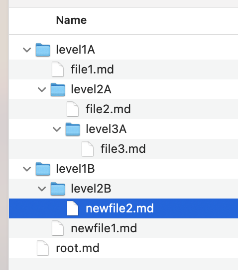

# Lab 1
yes we need to declare that 

## Trying new headlines and this is hash 2
yes thats very *obvious*

### Now we shall discuss why the apple fell on Newton
Really? You want to discuss that after these many years

#### No we are not I am just filling in 
**exactly** thank you

### Useful list of items 
(a.k.a using my CS to remember my groceries haha)
<ul>
  <li>Apple</li>
  <li>Banana</li>
  <li>Orange</li>
  <li>Strawberries</li>
</ul>

### Items of my School
(those good old days)
<ol>
  <li>Physics</li>
  <li>Computer Science</li>
  <li>>Literature</li>
  <li>English</li>
  <li>Math</li>
  <li>Chemistry</li>
  <li>Biology</li>
</ol>

## Coding
Python

                print("hello world")
                

---
HTML

                  num =  10
                  if num < 5:
                      print('Number is less than 5.')
                  else:
                      print('Number is greater than 5.')
               

This link takes you to [wikipedia](https://en.wikipedia.org/wiki/Main_Page)

## Here are the pictures:

> 

> 

## Table 

| Fruit | Colour | Shape | Size |
| ----- | ------ | ----- | ---- |
| Apple|    Red    |    Round   |    1.0kg  |
|  Banana     |   Yellow     |    Tube   |   0.5kg   |
|     Orange   |   Orange     |     Round  |  0.2kg    |
| Jack Fruit | Green | Oval | 5.0 kg|

